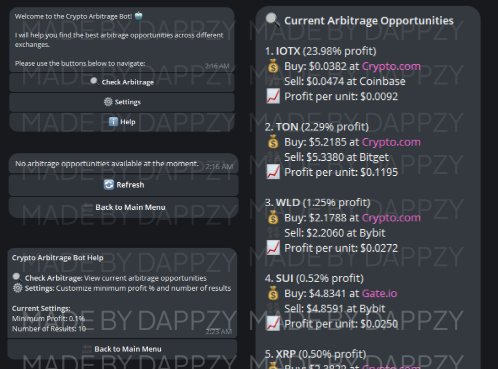

# Crypto Arbitrage Telegram Bot 🤖💰

A Telegram bot that helps you find cryptocurrency arbitrage opportunities across different exchanges in real-time. The bot compares prices across multiple exchanges and shows you where to buy low and sell high.



## Created By 👨‍💻

Built with ❤️ by [@DappChef](https://t.me/DappChef) on Telegram. Feel free to reach out if you:
- Have questions about the bot
- Need help with setup
- Want to discuss crypto trading
- Have suggestions for improvements
- Just want to connect!

## Features ✨

- Real-time price comparison across major exchanges
- Customizable minimum profit threshold
- Adjustable number of opportunities to display
- User-friendly interface with inline buttons
- Detailed profit calculations per trade
- Support for multiple cryptocurrencies

## Supported Exchanges 📊

- Binance Futures
- Coinbase
- Bitstamp
- Bybit
- OKX
- Gemini
- Gate.io
- Bitget
- Crypto.com
- XT.com
- Phemex

## Prerequisites 📋

- Node.js (v14 or higher)
- npm (Node Package Manager)
- Telegram account
- RapidAPI account

## Setup Instructions 🚀

### 1. Clone the Repository

```bash
git clone https://github.com/yourusername/crypto-arbitrage-bot.git
cd crypto-arbitrage-bot
```

### 2. Install Dependencies

```bash
npm install
```

### 3. Get Your API Keys

#### Telegram Bot Token:
1. Open Telegram and search for [@BotFather](https://t.me/BotFather)
2. Send `/newbot` command and follow the instructions
3. Copy the bot token provided

#### RapidAPI Key:
1. Visit [Crypto Arbitrage API](https://rapidapi.com/arjunravi868/api/crypto-arbitrage5) on RapidAPI
2. Sign up or log in to RapidAPI
3. Subscribe to the API (choose a plan that fits your needs)
4. Copy your RapidAPI key from the dashboard

### 4. Configure Environment Variables

1. Copy the example environment file:
   ```bash
   cp .env.example .env
   ```

2. Edit the `.env` file and add your API keys:
   ```env
   TELEGRAM_BOT_TOKEN=your_telegram_bot_token_here
   RAPIDAPI_KEY=your_rapidapi_key_here
   RAPIDAPI_HOST=crypto-arbitrage5.p.rapidapi.com
   ```

### 5. Start the Bot

```bash
npm start
```

## Usage 📱

1. Start a chat with your bot on Telegram
2. Send `/start` to begin
3. Use the inline buttons to:
   - Check current arbitrage opportunities
   - Adjust settings (minimum profit %, number of results)
   - View help information

## Settings ⚙️

You can customize these settings through the bot's interface:

- **Minimum Profit**: Set the minimum profit percentage to filter opportunities (default: 0.1%)
- **Number of Results**: Choose how many opportunities to display (default: 10)

## Example Output 📊

```
🔍 Current Arbitrage Opportunities

1. BTC (0.45% profit)
💰 Buy: $47250.25 at Coinbase
💱 Sell: $47463.80 at Bybit
📈 Profit per unit: $213.55

2. ETH (0.32% profit)
💰 Buy: $2350.75 at Binance
💱 Sell: $2358.27 at OKX
📈 Profit per unit: $7.52

[... more opportunities ...]
```

## Contributing 🤝

Contributions, issues, and feature requests are welcome! Feel free to check the [issues page](https://github.com/yourusername/crypto-arbitrage-bot/issues).

## License 📝

This project is licensed under the MIT License - see the [LICENSE](LICENSE) file for details.

## Disclaimer ⚠️

This bot is for informational purposes only. Cryptocurrency trading carries significant risks. Always do your own research and never trade more than you can afford to lose. Price differences between exchanges may not be actionable due to factors such as:

- Trading fees
- Withdrawal fees
- Transfer times
- Minimum trade amounts
- Exchange restrictions
- Market liquidity

## Support 💬

If you have any questions or need help, you can:
- Reach out to me directly on Telegram [@DappChef](https://t.me/DappChef)
- Open an issue on GitHub
- Send me a message on Twitter (if available)

I'm always happy to help and discuss crypto trading strategies!

## Star the Project ⭐

If you find this bot useful, please star the repository! It helps others discover the project and motivates further development.

## Buy Me a Coffee ☕

If you find this bot helpful and want to support its development, feel free to:
- Share it with others
- Give it a star on GitHub
- Reach out with suggestions
- Connect with me on Telegram [@DappChef](https://t.me/DappChef)
